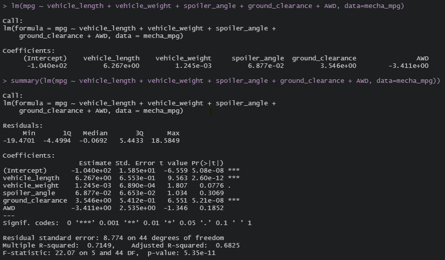

# Statistical Analysis using 'R'

## Overview:
The AutosRUs Company wishes to perform statistical analysis on their newest product: the MechaCar.

## Linear Regression to Predict MPG
Using R's linear model function (`lm()`), we assessed whether the MechaCar's length, weight, spoiler angle, ground clearance, or AWD had an impact to its  fuel efficiency (miles per gallon or mpg).

The output shown above tells us the following:
1.  The summary tells us the individual p-values (`Pr(>|t|)`) for each variable, which represents the probability that each variable contributes a random amount of variance to the linear model. Based on our results, it appears that the vehicle length and ground clearance appear to have a larger impact to the MechaCar's mpg / fuel-efficiency.
2. The linear model also provides a slope coefficient for each variable, which informs us of the relationship between the dependent variable (mpg) and each independent variable (length, weight, etc). Since the p-values indicate that vehicle length and ground clearance provide the more significant contributions to our linear model, we are most interesetd in the slope coefficients for these two variables. The output above tells us that the slope coefficient for vehicle length is 6.3 and the slope coefficient for ground clearance is 3.5.  
3. Finally, the linear model provides us with a Multiple R-squared value of 0.71. This value ranges from 0 to 1, and represents the proportion of the variability in our dependent variable that is explained by our linear model (an R-squared value of 1 means that the linear model 'perfectly' predicts our dependent variable). An R-squared value of 0.7 is generally considered to be high. In ourcase, the R-squared value is 0.71, which means that roughly 71% of the variability in the MechaCar's mpg can be explained by the 6 variables in our model. 

## Summary Statistics on Suspension Coils
Using dplyr's `summarize()` function, we generated 4 commonly used summary statistics to measure the central tendancy and spread of the vehicle suspension coil measurements (in PSI).

Additionally, we split the data by Manufacturing Lot (using the `group_by()` function), and calculated the same summary statistics for each lot.

The design specifications for the MechaCar suspension coils dictate that the variance of the suspension coils must not exceed 100 pounds per square inch. While we can see that the variance for all manufacturing lots is 62.3 (meets the design specifications), when we drill down to individual manfucaturing lots, we see that the variance in Lot 3 is 170.3, which does not meet our design specifications. More investigation is needed to assess whether the large variance observed in Lot 3 can be isolated, or whether there is a design flaw.

## T-Tests on Suspension Coils
Another popular statistics tests is the t-test (also known as the Student's t-test) which is useful in comparing the mean of one dataset to another. The output below shows the results of our t-test comparing all manufacturing lots against the population mean of 1500 PSI, as well as separate t-tests comparing each individual manufacturing lot's mean against the population.

When performing the t-test with all manufacturing lots combined, we observe a p-value of 0.06 which is just above 0.05, and we fail to reject our null hypothesis that there is no statistical difference between the observed sample mean and its presumed population mean. 

When we dig into the data and perform the t-test for each manufacturing lot however, we see a slightly different story. In Lot1, we have a p-value of 1 (max value), indicating that there is absolutely no difference between the sample mean and population mean (both are 1500). In Lot 2, the p-value is 0.61 (still much greater than 0.05) and again we fail to reject the null hypothesis that there is no statistical difference between the observed sample mean and its presumed population mean. Lot 3 however, tells us a different story. Here we see a p-value of 0.04 (< 0.05) which indicates that we should reject our null hypothesis, as there is a statistical difference betwen the observed sample mean (1496 PSI) and the population mean (1500 PSI).

## Study Design: MechaCar vs the Competition
In order to stand out against the competition, the AutosRUs team may also consider performing a statistical analysis of the safety rating of their MechaCar. One way to do this is to perform collision tests to determine the frequency of airbag malfunctions. 

Our Null Hypothesis would be that the probability of airbag malfunctions = 0 (the alternative hypothesis being that the probability of airbag malfunctions is > 0).

As our customers' lives would be at stake, we are more concerned with Type II errors (failing to reject the null hypothesis when it is actually false - i.e. that there is a probability (>0) that the MechaCar airbag will malfunction or fail to deploy). In order to mitigate this, it is recommended that a larger sample size is utilized. This may be costly to the Company (to repeatedly crash-test vehicles) but will increase the power of the statistical test. Another way to limit the risk of a Type II error, is to raise the level of significance (while 0.05 is most commonly used among statisticians, AutosRUs may consider using a higher level).

The AutosRUs team would need to compile airbag malfunction rates from competing car companies, as well as generate this data for the MechCar (i.e. perform a large number of crash tests on the MechaCar, noting the number of times the airbag malfunctioned or failed to deploy). Once this data is compiled, AutosRUs could perform two separate tests:
1. A simple one-sample t-test will reveal whether we must reject or fail to reject our null hypothesis (that the probability of MechaCar's airbag malfunctioning = 0). Failing to reject this hypothesis would be a great sign to potential buyers of the MechaCar.
2. A Two-sample t-test would also be great to show buyers whether there is a statistical difference between the airbag failure rates of the MechaCar vs any competing car models (Our null hypothesis being that there is no statistical difference between the failure rate of the MechaCar's airbags and that of its competitors).

## Tools:
- R with RStudio
    - Tidyverse (tidyr, dplyr)
    - ggplot2
 
